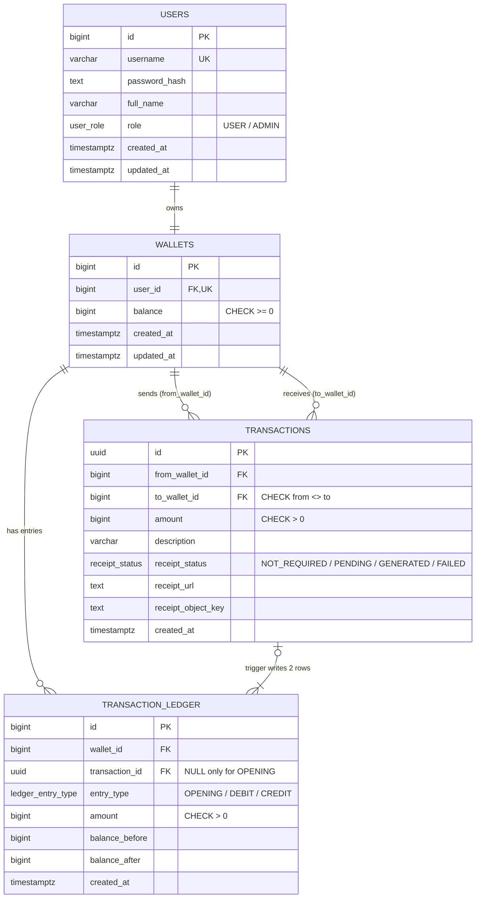

# Database Design

PostgreSQL 16, accessed only through the `pg` driver (no ORM). All money values are stored as
`BIGINT` in **Toman** — never floating point.

## ERD



## Enum types

| Type | Values |
|---|---|
| `user_role` | `USER`, `ADMIN` |
| `receipt_status` | `NOT_REQUIRED`, `PENDING`, `GENERATED`, `FAILED` |
| `ledger_entry_type` | `OPENING`, `DEBIT`, `CREDIT` |

## Tables

### `users`
| Column | Type | Constraints |
|---|---|---|
| id | BIGINT | PK, `GENERATED ALWAYS AS IDENTITY` |
| username | VARCHAR(50) | NOT NULL, UNIQUE |
| password_hash | TEXT | NOT NULL (bcrypt) |
| full_name | VARCHAR(100) | NOT NULL — shown in the "money received" notification |
| role | user_role | NOT NULL, DEFAULT `USER` |
| created_at / updated_at | TIMESTAMPTZ | NOT NULL, DEFAULT `now()` |

### `wallets`
| Column | Type | Constraints |
|---|---|---|
| id | BIGINT | PK, identity |
| user_id | BIGINT | NOT NULL, UNIQUE, FK → users(id) `ON DELETE RESTRICT` |
| balance | BIGINT | NOT NULL, DEFAULT 0, `CHECK (balance >= 0)` |
| created_at / updated_at | TIMESTAMPTZ | NOT NULL, DEFAULT `now()` |

`UNIQUE(user_id)` enforces the "one wallet per user" rule at the database level.
`CHECK (balance >= 0)` is a last line of defence even if the procedure logic had a bug.

### `transactions`
| Column | Type | Constraints |
|---|---|---|
| id | UUID | PK, DEFAULT `gen_random_uuid()` — not enumerable; reused as BullMQ `jobId` and MinIO object key |
| from_wallet_id | BIGINT | NOT NULL, FK → wallets(id) |
| to_wallet_id | BIGINT | NOT NULL, FK → wallets(id) |
| amount | BIGINT | NOT NULL, `CHECK (amount > 0)` |
| description | VARCHAR(255) | NULL |
| receipt_status | receipt_status | NOT NULL, DEFAULT `NOT_REQUIRED` |
| receipt_url | TEXT | NULL — download link stored by the worker |
| receipt_object_key | TEXT | NULL — e.g. `receipts/<id>.txt` |
| created_at | TIMESTAMPTZ | NOT NULL, DEFAULT `now()` |

Table-level checks:
- `CHECK (from_wallet_id <> to_wallet_id)` — no self-transfer.
- `CHECK ((receipt_status = 'GENERATED') = (receipt_url IS NOT NULL))` — a link exists iff the receipt was generated.

### `transaction_ledger`
Append-only history of every balance change. **Written only by a trigger** — never by Node.js.

| Column | Type | Constraints |
|---|---|---|
| id | BIGINT | PK, identity |
| wallet_id | BIGINT | NOT NULL, FK → wallets(id) |
| transaction_id | UUID | NULL, FK → transactions(id) |
| entry_type | ledger_entry_type | NOT NULL |
| amount | BIGINT | NOT NULL, `CHECK (amount > 0)` |
| balance_before | BIGINT | NOT NULL |
| balance_after | BIGINT | NOT NULL, `CHECK (balance_after >= 0)` |
| created_at | TIMESTAMPTZ | NOT NULL, DEFAULT `now()` |

Table-level checks:
- `CHECK (transaction_id IS NOT NULL OR entry_type = 'OPENING')`
- Arithmetic consistency:
  `(entry_type = 'DEBIT'  AND balance_after = balance_before - amount) OR`
  `(entry_type = 'CREDIT' AND balance_after = balance_before + amount) OR`
  `(entry_type = 'OPENING' AND balance_before = 0 AND balance_after = amount)`
- `UNIQUE (transaction_id, wallet_id)` — one entry per wallet per transfer.

`balance_before` / `balance_after` are an intentional denormalised snapshot: a ledger is an audit
record and must stay correct even if it is later read in isolation.

### `schema_migrations` (infrastructure)
| Column | Type |
|---|---|
| version | VARCHAR(255) PK — migration filename |
| applied_at | TIMESTAMPTZ DEFAULT `now()` |

## Indexes

| Index | Serves |
|---|---|
| `transactions (from_wallet_id, created_at DESC)` | user history — sent |
| `transactions (to_wallet_id, created_at DESC)` | user history — received |
| `transactions (created_at DESC)` | admin history across the whole system |
| `transactions (created_at) WHERE receipt_status = 'PENDING'` | worker recovery of stuck receipts (partial index) |
| `transaction_ledger (wallet_id, created_at DESC, id DESC)` | per-wallet ledger |

(`users.username`, `wallets.user_id` and `UNIQUE(transaction_id, wallet_id)` are indexed by their
unique constraints; the latter also serves "ledger rows of one transfer" lookups.)

## Database logic

### Stored procedure — `transfer_funds`

```sql
CALL transfer_funds(p_from_user_id, p_to_user_id, p_amount, p_description, p_threshold, INOUT o_transaction_id);
```

1. Validate `amount > 0` and sender ≠ receiver.
2. Lock **both** wallet rows in a deterministic order to avoid deadlocks:
   `SELECT ... FROM wallets WHERE user_id IN (a, b) ORDER BY id FOR UPDATE`.
3. Raise a custom SQLSTATE if a wallet is missing or the balance is insufficient
   (mapped to HTTP 404 / 422 by the Node error handler).
4. `INSERT INTO transactions` (`receipt_status = PENDING` when `amount > threshold`).
5. `set_config('app.current_transaction_id', <id>, true)` — transaction-local.
6. `UPDATE wallets` for sender (−amount) and receiver (+amount).
7. Return the new transaction id through the `INOUT` parameter. No `COMMIT` inside — the caller
   owns the transaction.

Isolation level: `READ COMMITTED` + row-level `FOR UPDATE` locks is sufficient; concurrent transfers
touching the same wallet are serialised on the lock.

### Triggers — `trg_wallet_opening_ledger` / `trg_wallet_balance_ledger`

Both call `fn_wallet_balance_ledger()`:

- `AFTER INSERT ON wallets` — when `balance > 0`, inserts an `OPENING` row (initial balance).
- `AFTER UPDATE OF balance ON wallets WHEN (OLD.balance IS DISTINCT FROM NEW.balance)` — inserts a
  `DEBIT` or `CREDIT` row with `balance_before = OLD.balance`, `balance_after = NEW.balance`, and
  `transaction_id = current_setting('app.current_transaction_id', true)::uuid`. If no transaction id is
  set, the balance was changed outside `transfer_funds` and the trigger raises `WL006`.

### Trigger — `trg_ledger_append_only`

`BEFORE UPDATE OR DELETE ON transaction_ledger` → `RAISE EXCEPTION`. The ledger is immutable.
